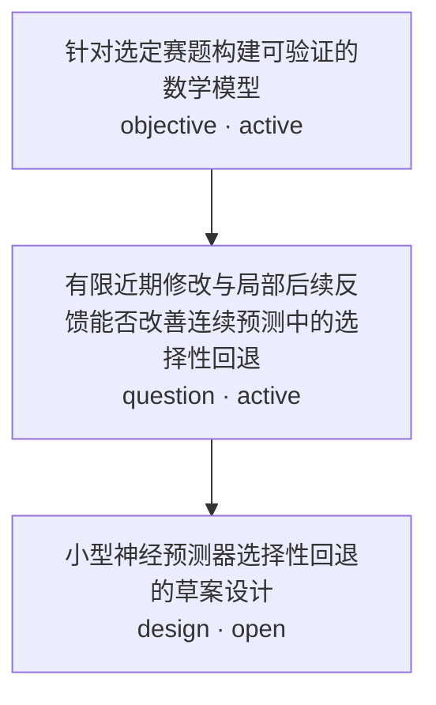

# Research Tree

## Graph

## Node Index

| Node | 类型 | 状态 | 科研对象 | 人类入口 |
| --- | --- | --- | --- | --- |
| N1 | objective | active | 针对选定赛题构建可验证的数学模型 | [打开](../RESEARCH.md) |
| N2 | question | active | 有限近期修改与局部后续反馈能否改善连续预测中的选择性回退 | [打开](../docs/competition/v2v-extraction-scope.md) |
| N3 | design | open | 小型神经预测器选择性回退的草案设计 | [打开](../designs/neural-readout-selective-rollback.md) |
