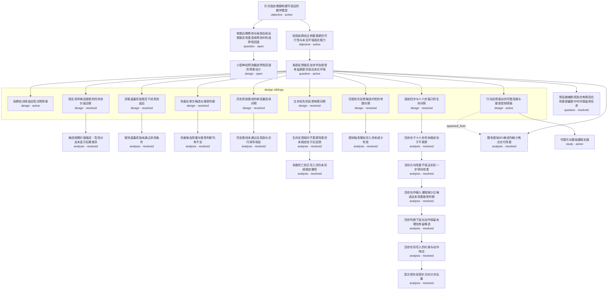

# Research Tree

## Graph

## Node Index

| Node | 类型 | 状态 | 科研对象 | 人类入口 |
| --- | --- | --- | --- | --- |
| N1 | objective | active | 针对选定赛题构建可验证的数学模型 | [打开](../RESEARCH.md) |
| N2 | question | open | 有限近期修改与局部后续反馈能否改善连续预测中的选择性回退 | [打开](../docs/competition/v2v-extraction-scope.md) |
| N3 | design | open | 小型神经预测器选择性回退的草案设计 | [打开](../designs/neural-readout-selective-rollback.md) |
| N4 | objective | active | 检验蚁群自主参数更新的可行性与未见环境适应能力 | [打开](../RESEARCH.md) |
| N5 | question | active | 局部反馈能否支持学会接受有益更新并适应未见环境 | [打开](../designs/ant-self-training-adaptation.md) |
| N6 | design | active | 蚁群自训练适应性对照草案 | [打开](../designs/ant-self-training-adaptation.md) |
| N7 | design | resolved | 陌生信号候选更新的同状态价值诊断 | [打开](../designs/candidate-update-value.md) |
| N8 | analysis | resolved | 候选短期价值描述：危险分支未显示后果差异 | [打开](../analysis/candidate-update-value/README.md) |
| N9 | design | resolved | 空载返巢奖励是否干扰危险适应 | [打开](../designs/return-reward-ablation.md) |
| N10 | analysis | resolved | 取消返巢奖励未通过采用条件 | [打开](../analysis/return-reward-ablation/README.md) |
| N11 | design | resolved | 伤害后单次候选与接受判断 | [打开](../designs/injury-candidate.md) |
| N12 | analysis | resolved | 伤害候选质量与接受判断均有不足 | [打开](../analysis/injury-candidate/README.md) |
| N13 | design | resolved | 历史奖励基线的单变量连续对照 | [打开](../designs/historical-baseline.md) |
| N14 | analysis | resolved | 历史基线未通过且奖励与交付排序相反 | [打开](../analysis/historical-baseline/README.md) |
| N15 | question | resolved | 势函数辅助奖励在有限回合和更新截断中何时保留原任务 | [打开](../docs/research/reward-shaping-boundaries.md) |
| N16 | design | resolved | 生存优先的反馈有限对照 | [打开](../designs/survival-feedback.md) |
| N17 | analysis | resolved | 生存反馈相对不更新改善但未稳定优于旧反馈 | [打开](../analysis/survival-feedback/README.md) |
| N18 | analysis | resolved | 多数死亡前已写入但仍未形成稳定避险 | [打开](../analysis/survival-timing/README.md) |
| N19 | design | resolved | 仅提前负反馈候选时机的有限对照 | [打开](../designs/feedback-trigger.md) |
| N20 | analysis | resolved | 提前触发增加写入但未减少失败 | [打开](../analysis/feedback-trigger/README.md) |
| N21 | design | resolved | 固定四步与十六步窗口的生存对照 | [打开](../designs/window-cadence.md) |
| N22 | analysis | resolved | 四步优于十六步但未稳定优于不更新 | [打开](../analysis/window-cadence/README.md) |
| N23 | analysis | resolved | 目标方向改善不保证实际一步转向改善 | [打开](../analysis/candidate-steering/README.md) |
| N24 | analysis | resolved | 四步动作输入课程缺少正候选且未改善接受判断 | [打开](../analysis/action-update-learning/README.md) |
| N25 | analysis | resolved | 四步判断下延长动作保留未增加有益候选 | [打开](../analysis/credit-history/README.md) |
| N26 | analysis | resolved | 四步实际写入的约束与动作响应 | [打开](../analysis/update-constraints/README.md) |
| N27 | analysis | resolved | 首次受伤前首步方向32步后果 | [打开](../analysis/first-action-outcomes/README.md) |
| N28 | analysis | resolved | 既有基础301候选均缺少焦点交付改善 | [打开](../analysis/candidate-label-coverage/README.md) |
| N29 | design | active | 行动反馈驱动的可塑连接与接受控制草案 | [打开](../designs/feedback-plasticity-course.md) |
| N30 | study | active | 可塑方向基础课程实施 | [打开](../study/feedback-plasticity-course/README.md) |
