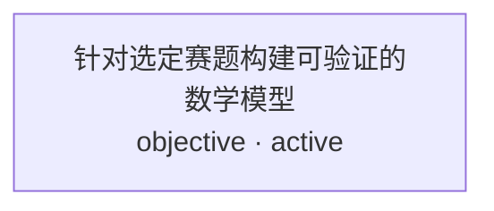

# Research Tree

## Graph

```mermaid
flowchart TD
    N1["针对选定赛题构建可验证的数学模型<br/>objective · active"]
```

## Node Index

| Node | 类型 | 状态 | 科研对象 | 人类入口 |
| --- | --- | --- | --- | --- |
| N1 | objective | active | 针对选定赛题构建可验证的数学模型 | [打开](../RESEARCH.md) |
